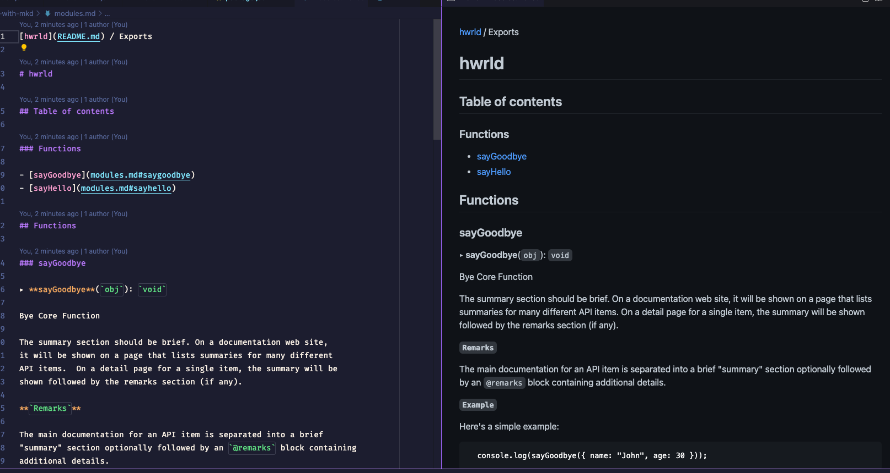
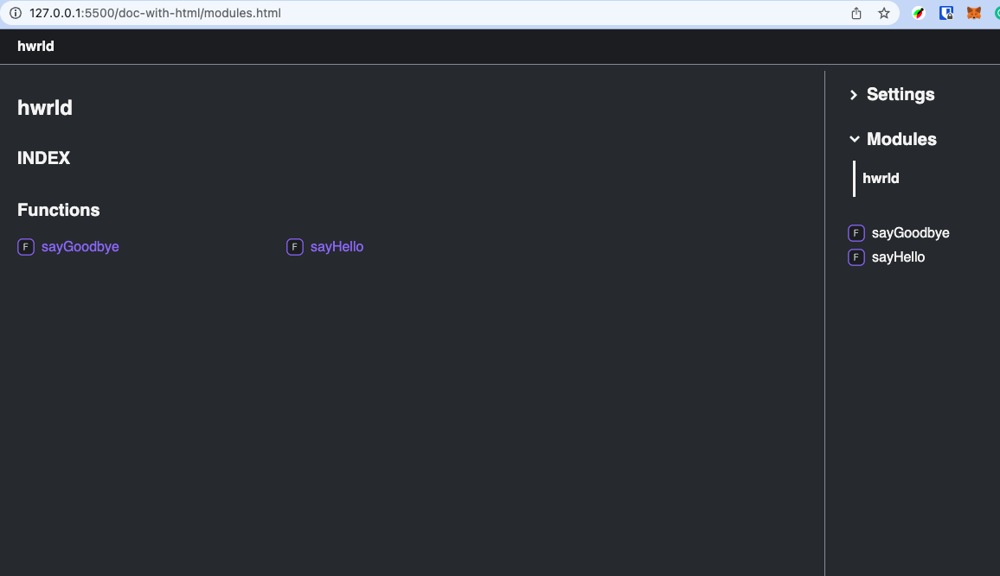
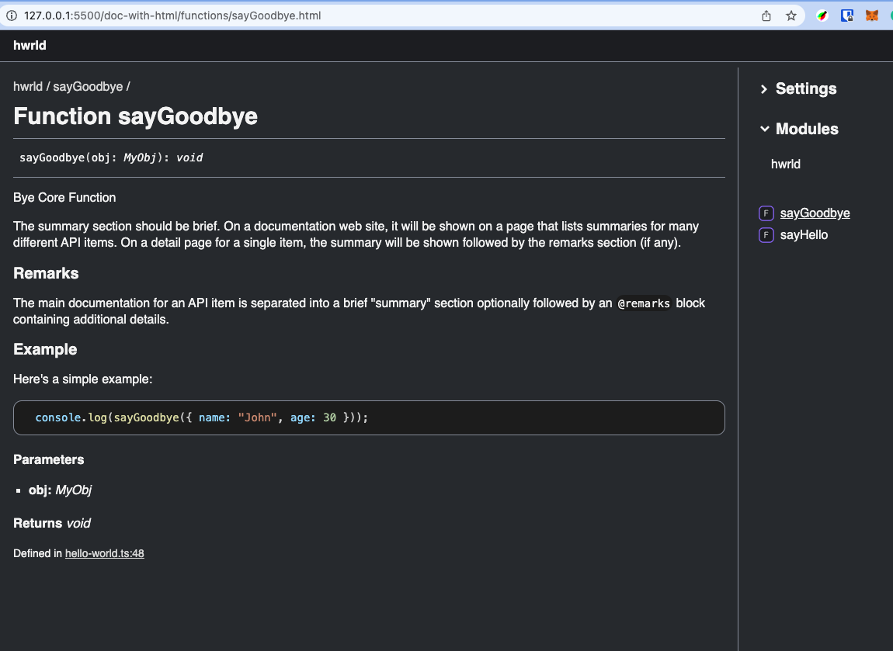

### Hi Docs

> Sample project with tsup and tsc, generates the documentation TSDOC standard and typedoc tool

### Markdown

### Web Page

### Refs

* [https://tsdoc.org/](https://tsdoc.org/)
* [https://tsdoc.org/play#](https://tsdoc.org/play#)
* [https://typedoc.org/](https://typedoc.org/)
* [https://typedoc.org/example/](https://typedoc.org/example/)
* [eslint-plugin-tsdoc](https://www.npmjs.com/package/eslint-plugin-tsdoc)

[https://blog.bitsrc.io/documenting-your-typescript-projects-there-are-options-da7c8c4ec554](https://blog.bitsrc.io/documenting-your-typescript-projects-there-are-options-da7c8c4ec554)
[https://blog.cloudflare.com/generating-documentation-for-typescript-projects/](https://blog.cloudflare.com/generating-documentation-for-typescript-projects)
[https://goulet.dev/posts/how-to-write-ts-interfaces-in-jsdoc/](https://goulet.dev/posts/how-to-write-ts-interfaces-in-jsdoc/)
### Author
🧢 Thiago Marinho